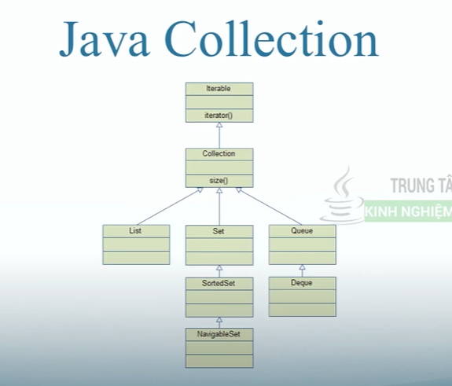
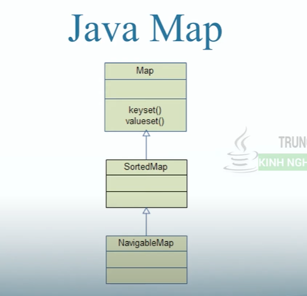

# 01 Hàm equals và hashCode trong Class
# 02 So sánh đối tượng == và hàm equals
# 03 Wrapper Class và Autoboxing
- wrapper class là những class java định nghĩa ra tương ứng với những kiểu dữ liệu cơ bản
  - Byte -> byte
  - Short -> short
  - Integer -> int
  - Long -> long
  - Float -> float
  - Double -> double
  - Boolean -> boolean
  - Character -> char
- boxing: tự chuyển từ kiểu cơ bản thành kiểu đối tượng
- unboxing: chuyển từ đối tượng thành cơ bản
# 04 Java Collections Cấu trúc dữ liệu và giải thuật
- Tập các thư viện class và interface có các thuật toán giúp người dùng làm việc với các đối tượng
- Chỉ làm việc với kiểu dữ liệu đối tượng
- Hoạt động hơi giống mảng nhưng cỡ có thể thay đổi linh động
- 2 nhóm chính: Collection và Map
- List: danh sách các phần tử, có thể trùng nhau
- Set: tập hợp các phần tử khác nhau
- Queue: giống như xếp hàng, phần tử được thêm vào cuối hàng
- Map: tập hợp giá trị key/value



## 04.1 List - Arraylist
- Chỉ việc lưu và truy xuất dữ liệu, dùng ArrayList sẽ tốt hơn
## 04.2 List - LinkedList
- Phù hợp với việc thường xuyên thêm sửa xoá phần tử
## 04.3 List - Vector
- Vector khác với ArrayList là mọi hàm đều là đồng bộ, hai thread chạy song song thì phải đợi nhau
- Hiệu suất của vector sẽ thấp hơn ArrayList, nhưng tính bảo mật cao hơn
# 05 Sắp xếp các phần tử trong List
```java
    Collections.sort(listInteger);
```
# 06 Comparable để so sánh và sắp xếp đối tượng trong List Java
# 07 Comparator dùng sắp xếp list đối tượng trong Java
# 08 Comparator - Sắp xếp theo nhiều tiêu chí
# 09 Iterator để lặp và xóa phần tử trong collection Java
- Có thể dùng cho List, Queue, Set
# 10 Java File đọc ghi List vào file
# 11 Set - HashSet
- Các phần tử là duy nhất
- Tự sắp xếp, không đảm bảo thứ tự nhập vào
- Hiệu suất tốt nhất
# 12 Set - LinkedHashSet
- Các phần tử sắp xếp theo thứ tự nhập vào
# 13 Set - TreeSet
- Đảm bảo phần tử được sắp xếp tăng dần theo thứ tự tự nhiên của nó
- Hiệu suất thấp
# 14 Queue - LinkedList
- Không đảm bảo các phần tử là duy nhất
# 15 Map - HashMap
- cặp key/value
- key là duy nhất
# 16 Map - TreeMap
- các phần tử đươc sắp xếp theo thứ tự tăng dần của key